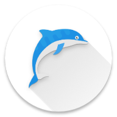

# DodgeDolphin

Es un juego de android que trata de un delfín que tiene que esquivar obstáculos en el fondo marino.

Posee dos skins:
 - `Deep Ocean`: En el oceano profundo. Zona Abisal
 - `Upper Ocean`: Cercana a la superficie. Zona del piélago.

El marcador de puntuación guarda el valor entre partidas y al terminar cada partida informa al jugador cuál fue la máxima puntuación obtenida.

### Estructura

Dentro de `DodgeDolphin/core` encontramos las clases que gestionan el juego, solo se encuentran los fichero .java y el build.gradle del modulo.

Dentro de `DodgeDolphin/android/assets` encontramos los recursos multimedia del juego como las texturas, las fuentes y los sonidos.

    

### Fuentes

Los sonidos fueron sacados de: 
- https://freesound.org/
- Las imágenes de: https://pixabay.com/es/
- Los recursos fueron creados con: Adobe Illustrator (`DodgeDolphin/android/assets/dodgedolphin.ai`)
